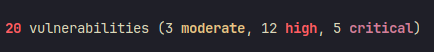

# Raport podatności znalezionych w aplikacji Webowej

Raport został przygotowany na potrzeby przedmiotu **Bezpieczeństwo Aplikacji Internetowych**.

Wykonali:
- Wioletta Drąg
- Stanisław Marek
- Aleksander Kuliński

### Poziomy podatności
- [CRITICAL] - podatność krytyczna, która może doprowadzić do całkowitego przejęcia aplikacji.
- [HIGH] - podatność wysokiego poziomu, która może doprowadzić do przejęcia aplikacji.
- [MEDIUM] - podatność średniego poziomu, która może doprowadzić do przejęcia konta użytkownika.
- [LOW] - podatność niskiego poziomu, która może doprowadzić do przejęcia konta użytkownika.
- [INFO] - informacja o podatności, która nie może doprowadzić do przejęcia aplikacji.
## Opis aplikacji
Audytowana aplikacja to prosty system do składania zamówień z dostępnych w bazie produktów.

Aplikacja posiada funkcjonalności:
- logowania / autentykacji użytkowników
- przeglądania dostępnych produktów
- składania zamówień

Kod źródłowy aplikacji dostępny jest w publicznym repozytorium: https://github.com/cr0hn/vulnerable-node

W repozytorium można znaleźć wylistowane podatności, które nie są jednak sprecyzowane gdzie się znajdują
## Podsumowanie wykonanych prac
Na podstawie dostępnego kodu wykonany został jego audyt, na podstawie którego zostały znalezione podatności na ataki i luki w bezpieczeństwie.

Każa ze znalezionych podatności została opisana. Opis zawiera:
- poziom podatności
- wyjaśnienie dlaczego jest to podatność i czym grozi
- propozycja rozwiązania problemu 

Po wykonaniu audytu zaproponowane zostały rozwiązania znalezionych błędów

## Znalezione podatności
### SQL Injection

**[CRITICAL]**
```js
function do_auth(username, password) {
    var db = pgp(config.db.connectionString);

    var q = "SELECT * FROM users WHERE name = '" + username + "' AND password ='" + password + "';";

    return db.one(q);
}
```
Ten fragment kodu to funkcja do uwierzytelniania, przyjmuje nazwę użytkownika i hasło.
Wykorzystuje bibliotekę pg-promise (v: 4.4.6 **DEPRECATED**) do obsługi połączenia z bazą.
Sposób, w jaki są łączone są nazwa użytkownika i hasło do zapytania, jest podatny na ataki SQL Injection.

Zabezpieczenie przed atakami SQL Injection:
- Używanie parametryzowanych zapytań.
- Używanie bibliotek, które automatycznie zabezpieczają przed atakami SQL Injection.
- Filtracja i walidacja danych wprowadzanych przez użytkownika.

Poza wyżej wspomnianym SQL Injection napotkać można je również w innych miejscach:
```js
function getProduct(product_id) {

    var q = "SELECT * FROM products WHERE id = '" + product_id + "';";

    return db.one(q);
}
```
```js
function search(query) {

    var q = "SELECT * FROM products WHERE name ILIKE '%" + query + "%' OR description ILIKE '%" + query + "%';";

    return db.many(q);

}
```
```js
function purchase(cart) {

    var q = "INSERT INTO purchases(mail, product_name, user_name, product_id, address, phone, ship_date, price) VALUES('" +
            cart.mail + "', '" +
            cart.product_name + "', '" +
            cart.username + "', '" +
            cart.product_id + "', '" +
            cart.address + "', '" +
            cart.ship_date + "', '" +
            cart.phone + "', '" +
            cart.price +
            "');";

    return db.one(q);

}
```


### Broken Authentication and Session Management

**[HIGH]**
```js
// Do auth
router.post('/login/auth', function(req, res) {

    var user = req.body.username;
    var password = req.body.password;
    var returnurl = req.body.returnurl;

    logger.error("Tried to login attempt from user = " + user);

    auth(user, password)
        .then(function (data) {
            req.session.logged = true;
            req.session.user_name = user;

            if (returnurl == undefined || returnurl == ""){
                returnurl = "/";
            }

            res.redirect(returnurl);
        })
        .catch(function (err) {
            res.redirect("/login?returnurl=" + returnurl + "&error=" + err.message);
        });

});
```
Ten fragment kodu to funkcja do uwierzytelniania, przyjmuje nazwę użytkownika, hasło i adres powrotu.
Sesja utrzymana jest za pomocą flagi **logged** i nazwy użytkownika **user_name**.

Potencjalne problemy wynikające z takiego mechanizmu uwierzytelniania:
- Brak możliwości ustawienia czasu wygaśnięcia sesji - sesja pozostanie aktywna do momentu wylogowania się użytkownika.
- Brak zabezpieczeń przed atakami typu brute-force - nie ma limitu prób logowania.
- Komunikat zwracany przy błędnym logowaniu to bezpośrednie wypisanie błędu zwróconego przez bazę danych. Mogą dostarczyć one informacji na temat struktury bazy danych, co może ułatwić atakującemu zadanie w przypadku próby przejęcia bazy danych.

### Dane logowania do bazy danych w kodzie źródłowym

**[HIGH]**
```yaml
version: '3.9'
services:
  vulnerable_node:
    restart: always
    build: .
    depends_on:
      - postgres_db
    ports:
      - "3000:3000"

  postgres_db:
    restart: always
    build: ./services/postgresql
    ports:
      - "5432:5432"
    environment:
      - POSTGRES_USER=postgres
      - POSTGRES_PASSWORD=postgres
```
W pliku docker-compose.yml znajdują się dane logowania do bazy danych.

Powinny być one przechowywane w zmiennych środowiskowych, najlepiej w pliku .env, który nie jest wersjonowany i/lub w repozytorium. 
### XSS - Cross Site Scripting

**[HIGH]**
#### JavaScript
```js
// Login template
router.get('/login', function(req, res, next) {

    var url_params = url.parse(req.url, true).query;

    res.render('login', {returnurl: url_params.returnurl, auth_error: url_params.error});
});
```
#### HTML
```html
...
<% if (auth_error != undefined) { %>
    <span class="label label-danger"><%-auth_error%></span>
<% } %>
...
```
Ten fragment kodu to funkcja renderująca szablon logowania.
Wartość parametru **error** jest wstawiana bezpośrednio do kodu HTML, co może doprowadzić do ataku XSS.

Przykładowe sposoby wykorzystania:
- Wykradanie ciasteczek sesji - czyli de facto przejęcie sesji użytkownika.
- Uruchomienie keyloggera - czyli przechwycenie wpisywanych danych.
- Przekierowanie na stronę phishingową - czyli przechwycenie danych logowania.
- Hostowanie malware - czyli zainfekowanie komputera użytkownika.

Jak zabezpieczyć się przed atakami XSS?
- Wszystkie dane wprowadzane przez użytkownika powinny być filtrowane i/lub walidowane.
- Wszystkie dane wyświetlane użytkownikowi powinny być filtrowane.
- Zastosowanie HttpOnly flag dla ciasteczek sesji. W ten sposób ciasteczka nie będą dostępne dla JavaScriptu.
  
### Konfiguracja cookies

**[MEDIUM]**
```js
app.use(session({
  secret: 'ñasddfilhpaf78h78032h780g780fg780asg780dsbovncubuyvqy',
  cookie: {
    secure: false,
    maxAge: 99999999999
  }
}));
```

W konfiguracji ciasteczek sesji znajdują się następujące problemy:
- Brak HttpOnly flagi - ciasteczka są dostępne dla JavaScriptu.
- Brak flagi secure - ciasteczka są wysyłane przez protokół HTTP, co może doprowadzić do ich przechwycenia.
- Bardzo długi czas wygaśnięcia ciasteczek sesji - sesja pozostanie aktywna do momentu wylogowania się użytkownika.
- Sekret sesji zaszyty jest w kodzie źródłowym aplikacji - powinien być przechowywany w zmiennych środowiskowych, najlepiej w pliku .env, który nie jest wersjonowany i/lub w repozytorium.

### Skan paczek NPM
**[CRITICAL]**

Po wykonaniu `npm audit` wynik wskazuje na wykorzystanie znaczącej ilości podatnych paczek:
- 3 średnie
- 12 wysokich
- 5 krytycznych



Należy zaktualizować paczki, bądź znaleźć alternatywną bibliotekę jeżeli wydawca nie udostępnił do tego czasu poprawionej wersji. Jeżeli nie ma żadnych alternatyw oraz popzednie wersje również zawierają podatności należy wykluczyć funkcjonalność, która wykorzystuje podatne pakiety.
Alternatywą może być napisanie własnego pakietu, który będzie spełniał standardy.

### Insecure Databse Design
**[HIGH]**

Hasła użytkowników trzymane w bazie są w formie plain textu bez szyfrowania
```js
var q = "SELECT * FROM users WHERE name = '" + username + "' AND password ='" + password + "';";
```
Analizując powyższe zapytanie do bazy danych nasuwający się wniosek to brak szyfrowania. Credentials użytkowników przechowywyane są jako zwykły tekst. W przypadku hasła jest to poważny błąd i może prowadzić do łatwego przejęcia dostępów dla użytkowników.

Aby rozwiązać tę podatność, należy zmienić schemat tabeli użytkowników w bazie danych. Powinno się kolumnę `password` zastąpić dwiema kolumnami `passwordHash` i `passwordSalt`, które będą przechowywać zaszyfrowane hasło dostępu.

### Unvalidated Redirects and Forwards

**[HIGH]**

```js
function check_logged(req, res) {

    if (req.session.logged == undefined || req.session.logged == false)
    {
        res.redirect("/login?returnurl=" + req.url);
    }
}
```


Powyższy fragment kodu jest podatny na atak, ponieważ nie zastosowano walidacji ani dodatkowych metod kontroli, w  celu zweryfikowania pewności adresu URL. Luka ta może zostać wykorzystana jako część oszustwa phishingowego poprzez przekierowanie użytkowników na złośliwą stronę.

Co należy zrobić  by eliminoc tą podatnosc:

- unikać używania przekierowań
- jeśli użyte zostało przekierowanie, należy nie zezwalać na adres URL jako dane wejściowe użytkownika do miejsca docelowego
- użytkownik powinien podać identyfikator lub token, który jest mapowany po stronie serwera na docelowy adres URL


### CSRF

**[CRITICAL]**

```js
router.all('/products/buy', function(req, res, next) {

    check_logged(req, res);

    var params = null;
    if (req.method == "GET"){
        params = url.parse(req.url, true).query;
    } else {
        params = req.body;
    }

    var cart = null;

    try {

        if (params.price == undefined){
            throw new Error("Missing parameter 'price'");
        }

        cart = {
            mail: params.mail,
            address: params.address,
            ship_date: params.ship_date,
            phone: params.phone,
            product_id: params.product_id,
            product_name: params.product_name,
            username: req.session.user_name,
            price: params.price.substr(0, params.price.length - 1) // remove "€" symbol
        }

        // Check mail format
        var re = /^([a-zA-Z0-9])(([\-.]|[_]+)?([a-zA-Z0-9]+))*(@){1}[a-z0-9]+[.]{1}(([a-z]{2,3})|([a-z]{2,3}[.]{1}[a-z]{2,3}))$/
        if (!re.test(cart.mail)){
            throw new Error("Invalid mail format");
        }

        // Checks all values is set
        for (var prop in cart){
            if (cart[prop] == undefined){
                throw new Error("Missing parameter '" + prop + "'");
            }
        }

    }
    catch (err){
        return res.status(400).json({message: err.message});
    }

    db_products.purchase(cart)
        .catch(function (err) {

            console.log(err);

            return res.json({message: "Product purchased correctly"});
        });

});

```

Uzytkownik jest w stanie utworzyć żądanie, które spowoduje zakupienie produktu z konta admina. Atak ma na celu skłonienie użytkownika zalogowanego do serwisu internetowego, aby uruchomił on odnośnik,którego otwarcie w ykona w owym serwisie akcję, do której atakujący nie miałby przeciwnym razie dostępu.

Metody ochrony przed CSRF:

- użycie losowych tokenów, związanych z zalogowaną sesja, sprawi, ze strona obsługująca formularz musi sprawdzić czy przekazany token to rzeczywiście jest wartość, która została generowana przez aplikacje
- użycie gotowych bibliotek, które mają możliwość ochrony
- użycie metody polegającej na wysyłaniu przez przeglądarkę użytkownika ten samej – losowo wygenerowanej przez aplikację wartości za pomocą: requestu HTTP oraz ciasteczka. Serwer sprawdza czy wartość zapisana w ciastku i wysłana danym requeście http jest taka sama.


